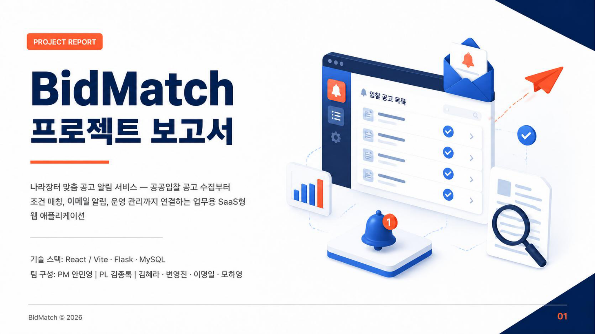
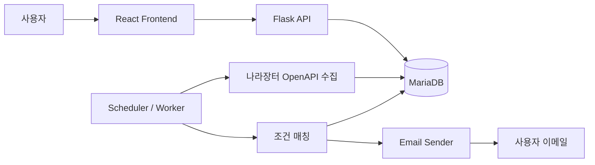
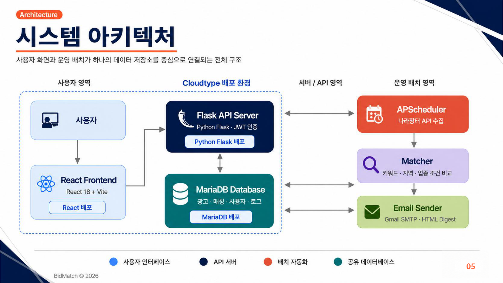
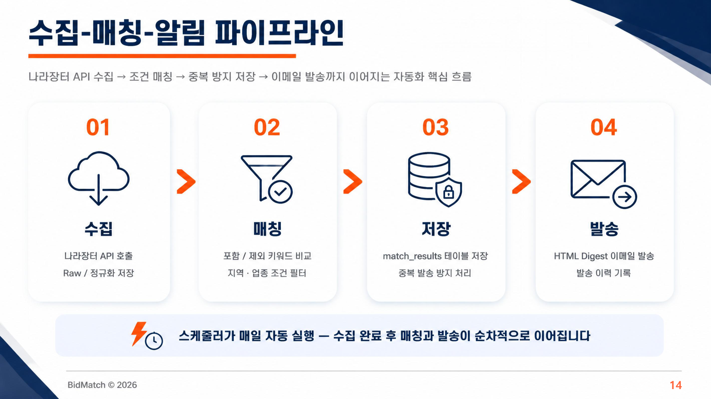

# BidMatch

<div align="center">
  
  <p>
    <strong>나라장터 입찰공고를 자동 수집하고, 기업별 관심 조건과 매칭해 이메일로 알려주는 B2B SaaS형 웹 애플리케이션</strong>
  </p>
  <p>
    <a href="https://www.youtube.com/watch?v=Omh36JkK0x0" target="_blank">
      
    </a>
  </p>
  <p>
    <a href="https://www.youtube.com/watch?v=Omh36JkK0x0">시연 영상 보기</a>
    ·
    <a href="./document">설계 문서</a>
    ·
    <a href="./front-end">프론트엔드</a>
    ·
    <a href="./back-end">백엔드</a>
  </p>
</div>

## 프로젝트 소개

BidMatch는 공공입찰 정보를 매일 확인해야 하는 기업 담당자의 반복 업무를 줄이기 위해 만든 서비스입니다. 나라장터 공공 API에서 입찰공고 데이터를 수집하고, 사용자가 등록한 키워드, 기관, 지역, 업종, 물품분류, 금액 조건과 비교해 관심 공고를 자동으로 선별합니다. 매칭된 공고는 이메일 Digest로 발송하고, 대시보드에서는 공고 목록, 마감 일정, 알림 이력, 운영 로그를 확인할 수 있습니다.

핵심 목표는 단순한 공고 검색기가 아니라, 입찰 담당자가 매일 반복하던 "검색, 조건 확인, 마감일 체크, 공유" 과정을 하나의 자동화 파이프라인으로 묶는 것입니다.

## 왜 필요한가

공공입찰 담당자는 나라장터에서 공고를 반복 검색하고, 기업 조건에 맞는지 확인하고, 마감일을 따로 관리해야 합니다. 이 과정은 다음과 같은 문제를 만듭니다.

| 문제 | BidMatch의 접근 |
| --- | --- |
| 공고 검색을 매일 수동으로 반복 | 나라장터 API 기반 정기 수집 |
| 키워드, 지역, 업종, 기관 조건을 매번 재입력 | 사용자별 관심 조건 저장 |
| 마감일과 개찰일 누락 위험 | 대시보드와 캘린더로 일정 표시 |
| 같은 공고를 여러 번 확인 | 공고 고유 키 기반 중복 방지 |
| 알림 발송 내역 추적 어려움 | 이메일 발송 이력과 상태 저장 |
| API 오류나 데이터 누락 분석 어려움 | Raw 데이터와 수집 로그 보관 |

## 주요 기능

### 1. 나라장터 공고 자동 수집

- 나라장터 입찰공고정보서비스 OpenAPI 연동
- 용역, 물품 공고 중심의 MVP 수집
- 최근 시간 범위 재조회와 보정 수집 지원
- 공고번호, 공고차수, 업무구분 기준 Upsert
- 마감 시간이 지난 공고 자동 `CLOSED` 처리
- 원본 응답 `raw_payload` 저장으로 파싱 오류와 API 변경 추적

### 2. 관심 조건 기반 매칭

- 포함 키워드와 제외 키워드 조건
- 기관, 지역, 업종, 업무구분, 물품분류 조건
- 예산 또는 추정가격 범위 조건
- 기업 유형과 보유 면허 조건 확장 가능
- 매칭 점수, 매칭 사유, 제외 키워드 저장
- 동일 사용자에게 동일 공고 중복 알림 방지

### 3. 이메일 Digest 알림

- 활성 사용자와 이메일 수신 동의 사용자를 대상으로 발송
- 매칭 공고 제목, 기관명, 마감일, 원본 링크 포함
- Gmail SMTP 또는 SMTP 제공자 연동 가능
- 발송 성공/실패 상태와 오류 메시지 저장
- 실패 건 재시도 정책 확장 가능

### 4. 사용자 업무 화면

- 사용자 대시보드
- 공고 검색과 목록 조회
- 공고 상세 보기
- 관심 조건 관리
- 마감일 캘린더
- 알림 이력
- 프로필과 기업 정보 설정

### 5. 관리자 운영 화면

- 사용자와 구독 상태 관리
- 공고 데이터 관리
- 수집 로그와 발송 로그 조회
- 수동 재조회
- 데이터 품질 지표 확인
- 운영 공지 관리

## 서비스 흐름



1. 사용자가 프로필, 기업 정보, 관심 조건을 등록합니다.
2. 백엔드 Worker가 나라장터 공공 API에서 공고를 주기적으로 수집합니다.
3. 수집된 공고는 정규화되어 MariaDB에 저장되고, 원본 응답도 함께 보관됩니다.
4. Matcher가 사용자별 관심 조건과 공고를 비교합니다.
5. 매칭 결과가 있는 사용자는 이메일 Digest를 받습니다.
6. 사용자는 대시보드에서 추천 공고, 마감 일정, 발송 이력을 확인합니다.

## 화면 구성

<div align="center">
  
</div>

| 구분 | 화면 |
| --- | --- |
| 진입 | 랜딩, 회원가입, 로그인, 비밀번호 재설정 |
| 사용자 | 대시보드, 공고 검색/목록, 공고 상세, 관심 조건 관리, 마감일 달력, 알림 이력, 내 정보 |
| 관리자 | 관리자 대시보드, 사용자 관리, 공고 데이터 관리, 수집 로그, 발송 로그, 수동 재조회 |

## 아키텍처

<div align="center">
  
</div>

| 영역 | 설명 |
| --- | --- |
| Frontend | React + Vite 기반 사용자/관리자 화면 |
| Backend API | Flask 기반 REST API, 인증, 공고 조회, 조건 관리 |
| Collector | 나라장터 OpenAPI 호출, 공고 수집, 원본 응답 저장 |
| Matcher | 공고와 사용자 관심 조건 비교, 매칭 결과 생성 |
| Email Sender | 매칭 결과 이메일 Digest 발송 |
| Database | 사용자, 기업 정보, 공고, 조건, 매칭 결과, 발송 이력, 수집 로그 저장 |
| Scheduler / Worker | 정기 수집, 보정 수집, 매칭과 알림 발송 실행 |

## 자동화 파이프라인

<div align="center">
  
</div>

```text
나라장터 OpenAPI
  -> Collector
  -> Raw + Normalized Bid Notices
  -> User Match Rules
  -> Match Results
  -> Email Notification Batches
  -> Email Send Histories
  -> Dashboard / Calendar / Logs
```

## 기술 스택

| 영역 | 기술 |
| --- | --- |
| Frontend | React 18.3.1, Vite 5.4.11, JavaScript JSX, React Router, Axios, Lucide React |
| Backend | Python 3.12, Flask 3, Flask-CORS, PyJWT |
| Scheduler | APScheduler, 독립 Worker 또는 Flask 내장 Worker |
| Database | MariaDB, PyMySQL |
| External API | 나라장터 입찰공고정보서비스, Google Gemini API, SMTP |
| Deployment | Cloudtype, GitHub Pages 문서 사이트 |

## 데이터 모델

BidMatch는 MVP 기준으로 다음 데이터를 중심으로 설계되었습니다.

| 테이블 | 역할 |
| --- | --- |
| `USERS` | 사용자 계정, 권한, 상태 |
| `USER_PROFILES` | 개인 프로필과 알림 설정 |
| `COMPANY_PROFILES` | 기업 정보, 업종, 면허, 정책 조건 |
| `USER_MATCH_RULES` | 사용자 관심 조건 |
| `BID_NOTICES` | 정규화된 입찰공고 |
| `PRODUCT_CATEGORIES` | 물품분류체계 |
| `COLLECTION_RUN_LOGS` | 수집 실행 로그 |
| `MATCH_RESULTS` | 공고와 조건의 매칭 결과 |
| `EMAIL_NOTIFICATION_BATCHES` | 사용자별 이메일 발송 묶음 |
| `EMAIL_SEND_HISTORIES` | 이메일 발송 상세 이력 |

자세한 ERD는 [document/03-database/erd.md](./document/03-database/erd.md)를 참고하세요.

## 주요 API

| Method | Path | 설명 |
| --- | --- | --- |
| `GET` | `/api/health` | 서버 상태 확인 |
| `GET` | `/api/bid-notices` | 수집된 입찰 공고 목록 조회 |
| `GET` | `/api/bid-notices/{noticeId}` | 입찰 공고 상세 조회 |
| `GET` | `/api/match-rules` | 사용자 관심 조건 목록 조회 |
| `POST` | `/api/match-rules` | 사용자 관심 조건 생성 |
| `PUT` | `/api/match-rules/{ruleId}` | 사용자 관심 조건 수정 |
| `DELETE` | `/api/match-rules/{ruleId}` | 사용자 관심 조건 삭제 |
| `GET` | `/api/email-histories` | 이메일 발송 이력 조회 |

## 프로젝트 구조

```text
BidMatch/
  assets/                  # README와 문서에 사용하는 이미지
  back-end/                # Flask API, 수집/매칭/알림 Worker
    api/                   # REST API 라우트
    core/                  # DB 연결과 스키마 관리
    jobs/                  # 수집, 백필, 매칭, 이메일 발송 작업
    repositories/          # DB 접근 계층
    services/              # 비즈니스 로직
    utils/                 # 인증 등 공통 유틸리티
  front-end/               # React + Vite 프론트엔드
    src/
      components/          # 재사용 UI 컴포넌트
      contexts/            # 인증 컨텍스트
      pages/               # 라우팅 단위 화면
      utils/               # API 클라이언트 등 유틸리티
  document/                # 요구사항, 아키텍처, DB, API, 운영 문서
  docs/                    # GitHub Pages 정적 사이트
  app.py                   # Cloudtype/Gunicorn용 루트 진입점
  requirements.txt         # 백엔드 의존성
```

## 시작하기

### 사전 요구사항

- Node.js 20.19.x LTS 이상 권장
- Python 3.12 계열 권장
- MariaDB 10.x 이상
- 나라장터 공공데이터포털 ServiceKey
- 이메일 발송용 SMTP 계정
- AI 요약 기능 사용 시 Google Gemini API Key

### 1. 저장소 클론

```powershell
git clone https://github.com/jjomton/bidmatch.git
cd bidmatch
```

### 2. 백엔드 실행

```powershell
cd back-end
python -m venv .venv
.\.venv\Scripts\Activate.ps1
pip install -r requirements.txt
copy .env.example .env
python app.py
```

기본 API 서버 주소는 `http://localhost:5000`입니다.

### 3. 프론트엔드 실행

```powershell
cd front-end
npm install
copy .env.example .env
npm run dev
```

기본 Vite 개발 서버는 `http://localhost:5173`입니다.

### 4. 수집 Worker 실행

```powershell
cd back-end
python -m jobs.hourly_collect_bid_notices_worker
```

운영 환경에서는 웹 서버 프로세스와 수집 Worker 프로세스를 분리하는 방식을 권장합니다.

## 환경 변수

실제 비밀값은 저장소에 올리지 않고, 각 환경의 `.env`에서 관리합니다.

### Frontend

```env
VITE_API_BASE_URL=http://localhost:5000
```

### Backend

```env
FLASK_ENV=development
SECRET_KEY=change-me

DB_HOST=localhost
DB_NAME=bidmatch
DB_USER=bidmatch_user
DB_PASSWORD=strong-password
DB_PORT=3306
DB_AUTO_SYNC_SCHEMA=true

CORS_ORIGINS=http://localhost:5173,http://localhost:3000

G2B_API_KEY=your_service_key
G2B_API_BASE_URL=http://apis.data.go.kr/1230000/ad/BidPublicInfoService
G2B_COLLECT_ENDPOINTS=getBidPblancListInfoServc,getBidPblancListInfoThng
G2B_LOOKBACK_HOURS=2
G2B_COLLECT_INTERVAL_SECONDS=3600

SMTP_HOST=smtp.gmail.com
SMTP_PORT=587
SMTP_USER=your-email@gmail.com
SMTP_PASSWORD=your-app-password
SMTP_FROM=your-email@gmail.com

GEMINI_API_KEY=your_gemini_api_key
```

## GitHub Pages

이 저장소에는 GitHub Pages용 정적 사이트가 `docs/`에 포함되어 있습니다. `master` 브랜치에 push하면 `.github/workflows/pages.yml` 워크플로가 `docs/` 폴더를 Pages로 배포합니다.

배포 후 예상 주소:

```text
https://jjomton.github.io/bidmatch/
```

GitHub 저장소의 `Settings > Pages`에서 Source가 `GitHub Actions`로 설정되어 있어야 합니다.

## 참고 문서

| 문서 | 설명 |
| --- | --- |
| [통합 요구사항 리스트](./document/01-requirements/consolidated-requirements-list.md) | 기능 요구사항과 우선순위 |
| [시스템 개요](./document/02-architecture/system-overview.md) | 전체 구성과 흐름 |
| [ERD](./document/03-database/erd.md) | 데이터 모델 |
| [나라장터 OpenAPI 분석](./document/04-api/g2b-openapi-analysis.md) | 외부 API 활용 전략 |
| [내부 API 명세](./document/04-api/internal-api.md) | 백엔드 API |
| [페이지 구조](./document/05-design/page-structure.md) | 사용자/관리자 화면 구성 |
| [이메일 알림 정책](./document/06-email/notification-policy.md) | 발송 대상과 중복 방지 |
| [운영 문서](./document/07-operations/README.md) | 배포와 운영 가이드 |
| [트러블슈팅](./document/09-troubleshooting/README.md) | 장애 기록과 대응 템플릿 |

## 개발 로드맵

1. 회원가입, 로그인, 인증 토큰 검증
2. 사용자 프로필과 기업 정보 저장
3. 관심 조건 CRUD
4. 나라장터 API 수집과 Raw 저장
5. 공고 목록/상세/검색/CSV 다운로드 API
6. 사용자 조건 기반 매칭
7. 이메일 Digest 발송
8. 알림 이력 조회
9. 마감일 캘린더와 대시보드 요약
10. 관리자 수집/발송 로그와 수동 재조회
11. 추천 검색어와 일치도 점수
12. AI 요약, 카카오 알림톡, 변경이력 반영 등 확장 기능

## 팀

| 이름 | 역할 | 담당 |
| --- | --- | --- |
| 안민영 | PM | 시스템 설계, 프로젝트 관리, 일정/범위/구조 조율, 산출물 정리 |
| 김종록 | PL | 소셜 로그인, 이메일 발송 파이프라인, Gemini 연동과 요약 로직 |
| 김혜라 | 팀원 | 사용자 대시보드, 공고 목록/통계/검색 화면 UI/UX |
| 변영진 | 팀원 | 나라장터 공공 API 수집, 데이터 연동 파이프라인 |
| 이명일 | 팀원 | 마감일 캘린더, 공고 상세 화면, 사용자 관리 로직 |

## 라이선스

현재 별도 라이선스 파일은 포함되어 있지 않습니다. 외부 공개 또는 재사용 범위를 정하려면 `LICENSE` 파일을 추가해 주세요.
